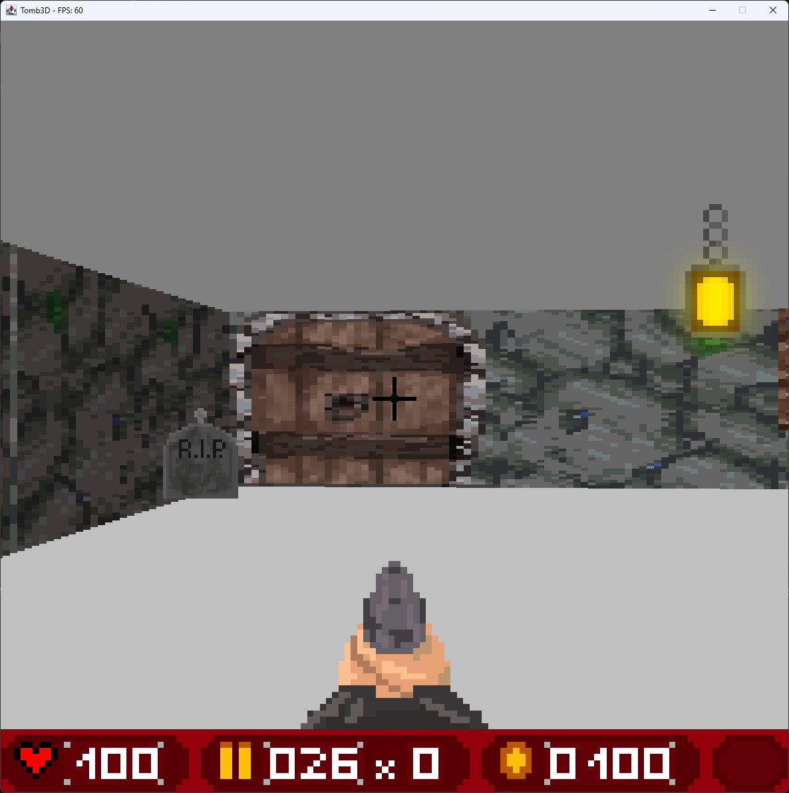
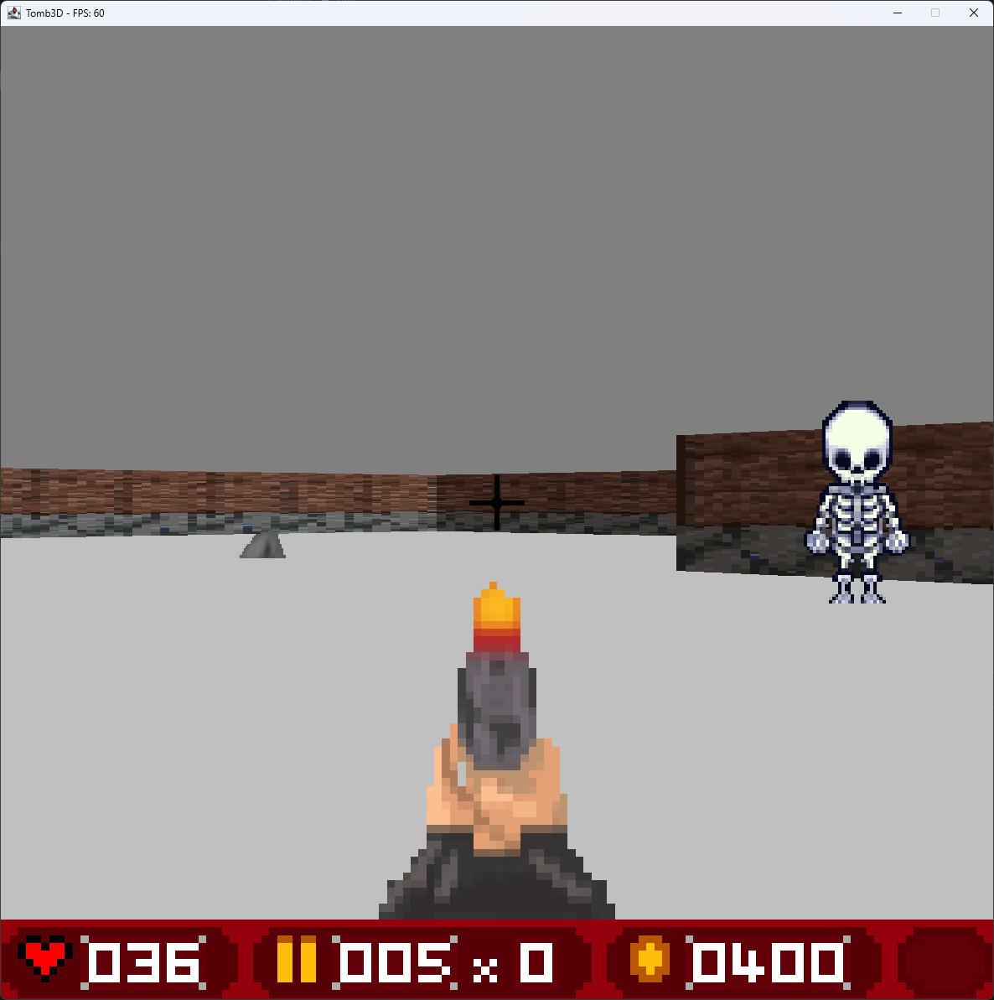
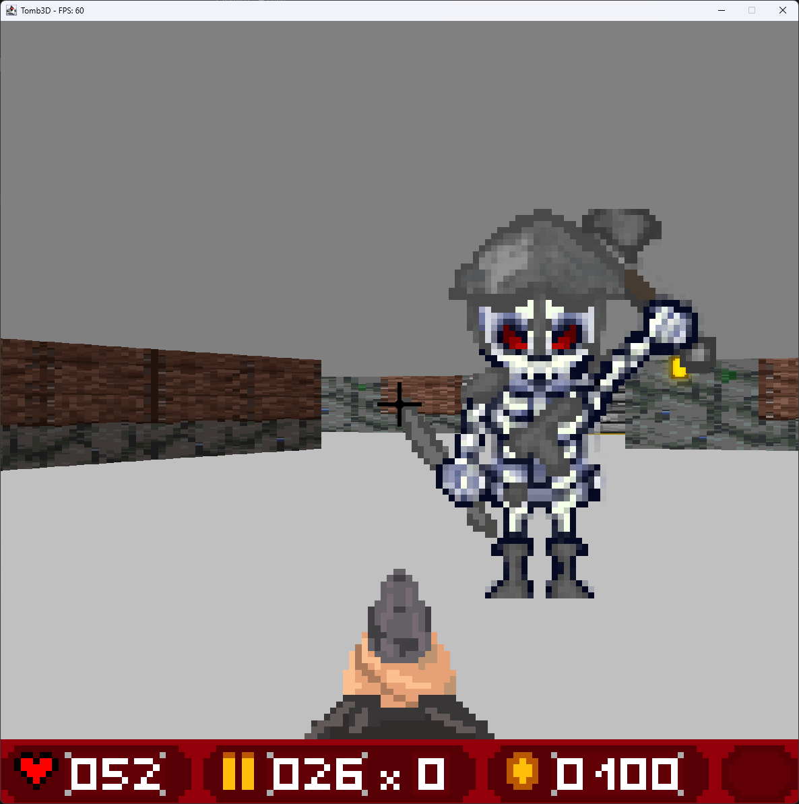

## Tomb3D
Tomb3D is a pseudo 3D game based on the raycasting algorithm and inspired by the game Wolfenstein3D. It utilizes the Java Swing library and is fully developed from scratch. This project was created as the final project for the course "Game Programming" at the University of Applied Sciences in Ulm over the span of 3 months with the preliminaries being only using Java and the Swing library. The game features a level editor, custom textures, and sounds, as well as a highscore system. The game is fully playable and can be downloaded and played on any system with Java installed. \
Due to the nature of the project, the game is not optimized for performance and may not run smoothly on older systems.

## Lore
John Doe is a lone adventurer and tomb explorer, always keeping an eye open for valuable treasures. One day, Doe found a deep opening in a left ancient temple. He crawled through tight passages until he reached the center of the temple where a huge dark hole yawned before him. Unbeknownst to Doe, this ominous abyss was a gate way to the old tombs of the old native people. While getting closer to the underworld, Doe triggered the awakening of the monsters, guarding the treasures and tombs of the ancient.

## Controls:
- `W` or `↑` - Move forward
- `S` or `↓` - Move backward
- `A` or `←` - Rotate left
- `D` or `→` - Rotate right
- `Space` - Shoot
- `E` - Open/Close doors
- `Shift` - Sprint

## Objective
- Collect as many treasures as possible
- Find the key to unlock the exit
- Kill as many enemies as possible
- Survive

## Screenshots
 \
 \
 \

## Requirements
Java Runtime Environment

## License
Distributed under the MIT License.

## Credits
- [Leo](https://www.instagram.com/leo_ception_/) - Wall Textures
- [Nikita Kovach](https://github.com/kovani01) - Enemy Textures, Animations, Map Editor
- [Max Staudenmaier](https://github.com/staudenmaiermax) - Sound Effects, Music, Sound Engine

## Sources
- ["Super Fast Ray Casting in Tiled Worlds using DDA" by javidx9](https://youtu.be/NbSee-XM7WA?si=9yfZXxtmH0g_dTnR)
- ["Making a Basic 3D Engine in Java" by sheeptheelectric](https://www.instructables.com/Making-a-Basic-3D-Engine-in-Java/)
- ["Make Your Own Raycaster Series" by 3DSage](https://youtu.be/gYRrGTC7GtA?si=Wf8iMP8HbzdcR-xt)
- ["Implementing a Ray Caster Part 2: Sprite Rendering" by Liam Wynn](https://wynnliam.github.io/raycaster/news/tutorial/2019/04/03/raycaster-part-02.html)
- ["Raycasting"](https://de.wikipedia.org/wiki/Raycasting)
- ["Lode's Computer Graphics Tutorial"](https://lodev.org/cgtutor/raycasting.html)
